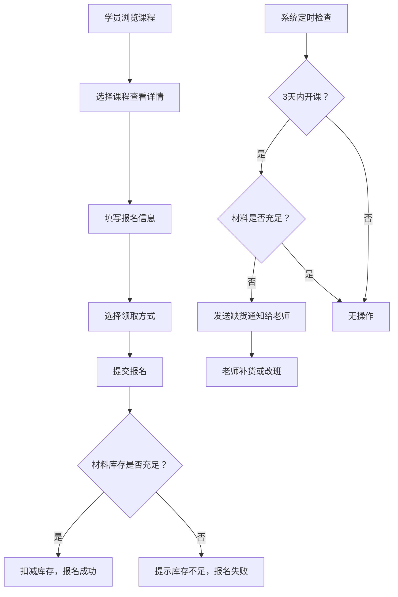

## 1. 产品概述

手作课程材料包预订站，专为陶艺、银饰、皮具三类手作课程设计。老师可发布课程并管理材料包库存，学员可通过移动端便捷报名，系统自动根据报名人数扣减材料包库存，临近开课时如材料不足将自动通知老师进行改班或补货。

- 目标用户：手作课程老师与手作爱好者
- 核心价值：简化课程管理流程，确保材料供应，提供流畅的移动端报名体验

## 2. 核心功能

### 2.1 用户角色

| 角色 | 说明 | 核心权限 |
|------|------|----------|
| 老师 | 发布课程的手作讲师 | 发布/编辑课程、管理材料库存、查看报名、接收缺货通知 |
| 学员 | 报名参加课程的用户 | 浏览课程、报名选课、选择领取方式、查看报名记录 |

### 2.2 功能模块

1. **首页（课程列表）**：课程分类筛选、课程卡片展示、角色切换入口
2. **课程详情页**：课程信息展示、报名表单、领取方式选择（到店/快递）
3. **老师后台**：课程管理、材料库存管理、报名名单查看、缺货通知中心
4. **学员中心**：我的报名记录、订单状态查看

### 2.3 页面详情

| 页面名称 | 模块名称 | 功能描述 |
|----------|----------|----------|
| 课程列表页 | 分类标签栏 | 陶艺/银饰/皮具/全部课程切换 |
| 课程列表页 | 课程卡片 | 展示课程封面、名称、老师、时间、价格、剩余名额 |
| 课程列表页 | 角色切换 | 老师/学员身份切换入口 |
| 课程详情页 | 课程信息 | 课程描述、材料清单、开课时间、地点 |
| 课程详情页 | 报名表单 | 姓名、手机号、人数、备注 |
| 课程详情页 | 领取方式 | 到店领取 / 快递配送（填写地址） |
| 老师后台 | 课程管理 | 发布新课程、编辑课程、上下架 |
| 老师后台 | 库存管理 | 设置材料包数量、查看库存状态 |
| 老师后台 | 报名名单 | 查看报名学员信息、领取方式统计 |
| 老师后台 | 通知中心 | 材料不足预警、开课提醒 |
| 学员中心 | 我的报名 | 查看历史报名记录、订单状态 |

## 3. 核心流程

### 主要用户流程描述

**学员报名流程：**
学员打开移动端页面 → 浏览课程列表（可按分类筛选）→ 点击感兴趣的课程查看详情 → 填写报名信息（姓名、手机号、人数）→ 选择领取方式（到店领取/快递配送）→ 提交报名 → 系统自动扣减对应材料包库存 → 显示报名成功页面。

**老师发布课程流程：**
老师切换到老师身份 → 进入后台 → 点击"发布新课程"→ 填写课程信息（名称、分类、描述、时间、地点、价格、材料包数量）→ 提交发布 → 课程上架显示在列表中。

**缺货预警流程：**
系统定时检查所有即将开课（3天内）的课程 → 对比已报名人数与材料包库存 → 如库存不足（报名人数>库存或剩余库存<预警阈值）→ 生成缺货通知发送给老师 → 老师可选择补货或改期。

## 4. 用户界面设计

### 4.1 设计风格

- **主色调**：温暖土棕色 #8B6F47（手作/陶艺感），搭配奶油米色 #F5F0E6
- **辅助色**：陶土橙 #D97757（强调按钮）、森林绿 #5A7D5A（状态提示）
- **按钮风格**：圆角矩形，饱满有质感，带有微阴影
- **字体**：标题使用 Noto Serif SC（有手作文艺感），正文使用系统字体
- **布局风格**：卡片式布局，移动端优先，大点击区域，适合触控操作
- **图标风格**：线性图标，简洁优雅

### 4.2 页面设计概述

| 页面名称 | 模块名称 | UI元素 |
|----------|----------|--------|
| 课程列表页 | 分类标签栏 | 横向滚动标签，选中态底部橙色线条 |
| 课程列表页 | 课程卡片 | 圆角卡片，顶部图片，下方信息网格 |
| 课程详情页 | 报名表单 | 底部固定报名按钮，表单字段大输入框 |
| 课程详情页 | 领取方式 | 卡片式单选，快递方式展开地址表单 |
| 老师后台 | 库存管理 | 库存进度条，低库存红色高亮 |
| 老师后台 | 通知中心 | 红色角标数字提示，通知条目带图标 |

### 4.3 响应式设计

- **移动端优先**：所有页面基于 375px 宽度设计，使用 Tailwind 响应式断点
- **触控优化**：按钮最小高度 48px，输入框间距充足，避免误触
- **适配范围**：320px - 430px 手机屏幕完美适配，平板和桌面端居中展示

### 4.4 动效设计

- 页面切换：底部 Tab 平滑过渡
- 卡片交互：点击微缩放 + 阴影加深
- 库存预警：低库存时红色脉冲动画
- 表单提交：按钮 Loading 状态动画
