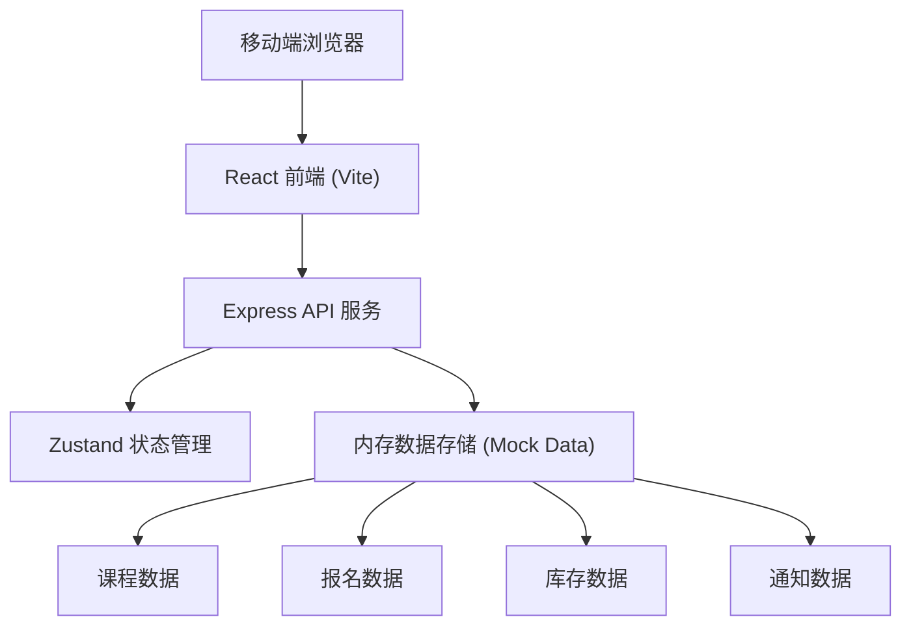
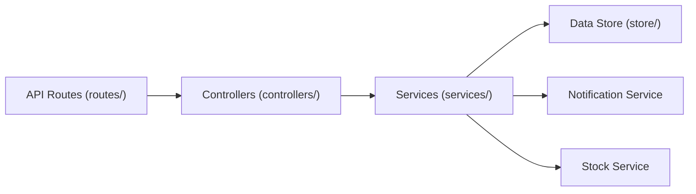
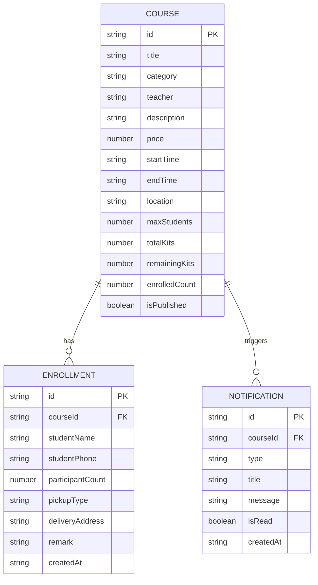

## 1. 架构设计



## 2. 技术描述

- **前端**：React@18 + TypeScript + Vite + TailwindCSS@3 + Zustand + React Router DOM
- **后端**：Express@4 + TypeScript
- **图标库**：lucide-react
- **数据存储**：内存数据存储（带初始化 Mock 数据，演示用）
- **初始化工具**：vite-init (react-express-ts 模板)

## 3. 路由定义

| 前端路由 | 页面 | 说明 |
|----------|------|------|
| / | 课程列表页 | 首页，展示所有课程，支持分类筛选 |
| /course/:id | 课程详情页 | 展示课程详情，提供报名表单 |
| /success/:id | 报名成功页 | 展示报名成功信息 |
| /teacher | 老师后台首页 | 课程管理概览 |
| /teacher/create | 发布课程页 | 老师发布新课程表单 |
| /teacher/course/:id | 课程管理详情 | 查看报名名单、管理库存 |
| /teacher/notifications | 通知中心 | 缺货预警、开课提醒 |
| /student | 学员中心 | 我的报名记录 |

### API 接口路由

| Method | Route | 功能 |
|--------|-------|------|
| GET | /api/courses | 获取课程列表（支持分类筛选） |
| GET | /api/courses/:id | 获取课程详情 |
| POST | /api/courses | 创建新课程 |
| PUT | /api/courses/:id | 更新课程信息 |
| PUT | /api/courses/:id/stock | 更新课程材料库存 |
| GET | /api/courses/:id/enrollments | 获取课程报名名单 |
| POST | /api/enrollments | 提交报名（自动扣减库存） |
| GET | /api/enrollments/student/:phone | 获取学员报名记录 |
| GET | /api/notifications | 获取老师通知列表 |
| PUT | /api/notifications/:id/read | 标记通知已读 |
| POST | /api/notifications/check-stock | 触发库存检查（生成缺货通知） |

## 4. API 定义

### 类型定义

```typescript
// 课程类型
type CourseCategory = 'pottery' | 'silver' | 'leather';

interface Course {
  id: string;
  title: string;
  category: CourseCategory;
  teacher: string;
  description: string;
  materials: string[];
  coverImage: string;
  price: number;
  startTime: string;
  endTime: string;
  location: string;
  maxStudents: number;
  totalKits: number;
  remainingKits: number;
  enrolledCount: number;
  isPublished: boolean;
  createdAt: string;
}

// 报名类型
type PickupType = 'store' | 'delivery';

interface Enrollment {
  id: string;
  courseId: string;
  studentName: string;
  studentPhone: string;
  participantCount: number;
  pickupType: PickupType;
  deliveryAddress?: string;
  remark?: string;
  createdAt: string;
}

// 通知类型
type NotificationType = 'stock_warning' | 'course_reminder';

interface Notification {
  id: string;
  courseId: string;
  type: NotificationType;
  title: string;
  message: string;
  isRead: boolean;
  createdAt: string;
}
```

## 5. 服务器架构



- **routes**: 定义 API 路由
- **controllers**: 处理请求/响应
- **services**: 业务逻辑（报名处理、库存扣减、通知生成）
- **store**: 内存数据访问层

## 6. 数据模型

### 6.1 实体关系图



### 6.2 初始化数据

系统启动时自动加载以下 Mock 数据：
- 3 个示例课程（陶艺、银饰、皮具各一个）
- 每个课程包含完整的信息和初始库存
- 部分示例报名记录
- 示例缺货通知
